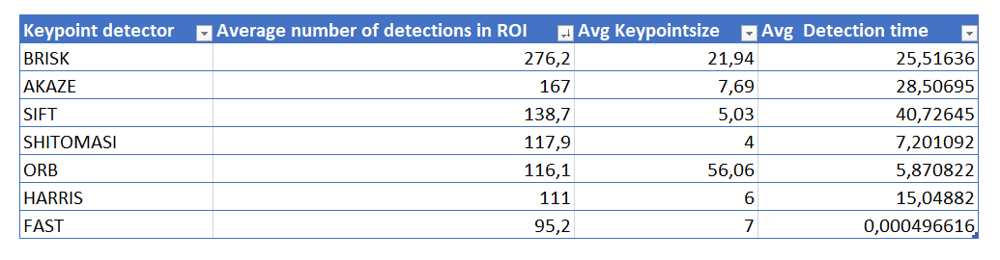
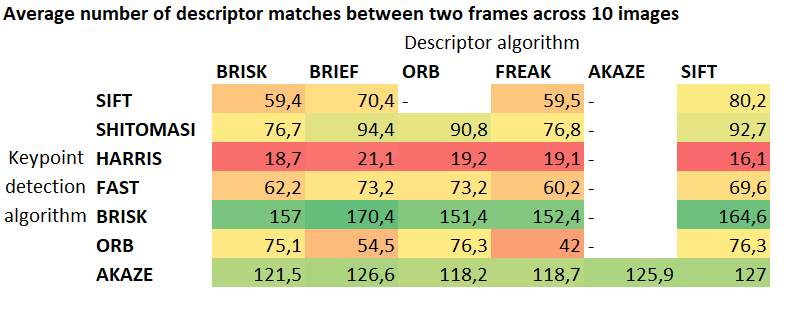
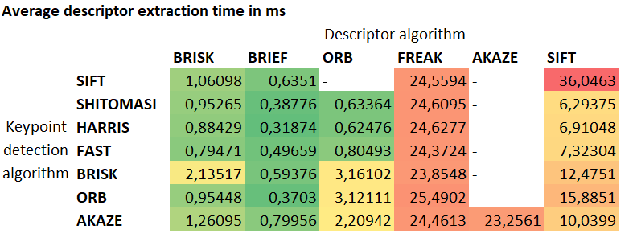
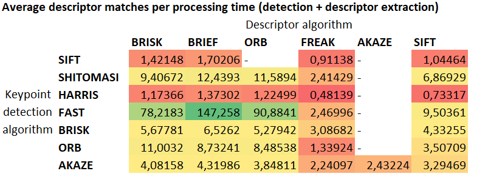

# Writeup / Analysis

## Implementation
### MP.1 Data Buffer Optimization
The vector implementation is probably the worst data structure for the intended purpose. This has been replaced 
by a STL queue. This is a much more efficient way to handle a data buffer of a fixed size.

### MP.2 - MP.6
See code for implementations.

## Performance Analysis
I've implemented extensive logging capabilities and refactored much of the code to perform performance tests. These are the results.
### MP.7 Keypoint detector
The following table ranks the keypoint detection algorithms based on the average number of keypoints detected within the region of interest (roi).

BRISK, AKAZE and SIFT yield the most detections within the ROI. The average detection time covers the processing time for the entire image.

### MP.8 Keypoint matching / Recall
Below are the results for all possible keypoint detector / descriptor algorithm combinations.
The figure below shows the number of keypoint/descriptor matches across two frames, averaged across 10 images. 

The BRISK keypoint detector clearly outperforms all other algorithms in terms of how many keypoints it matches across frames regardless which descriptor algorithm it uses.

### MP.9 Runtime analysis
The runtime for the keypoint detection is shown in the first table. This table adds the runtime analysis of the descriptor extraction algorithms in combination with the relevant keypoint detectors.

The fastest extraction times can be observed for the binary desriptors, especially BRIEF and ORB.
Based on these results I've calculated an efficiency score which relates the average matching performance to the average runtime, consisting of the detection runtime and the descriptor extraction runtime.

The FAST detection algorithm performs best on this metric, due to its very fast detection runtime.

### Conclusion
Which algorithms to choose comes down to the requirements. Unless the goal is to minimize the runtime, then those algorithms should be chosen which provide the highest number of descriptor matches on average while satisfying the runtime constraints.
BRISK yields the best matching results regardless of the descriptor and should be chosen if it satisfies the runtime constraints. If BRISK is computationally intensive, SHITOMASI with BRIEF provides a good compromise between runtime and recall. FAST is a good choice for computational constraints or high speed tracking.